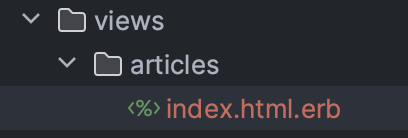
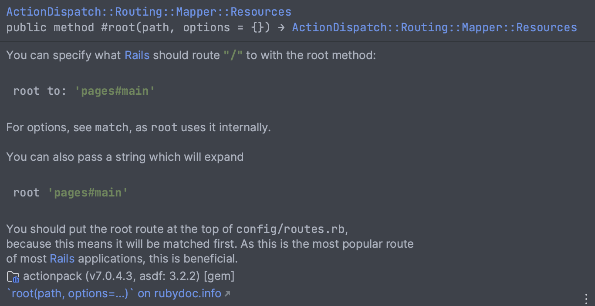
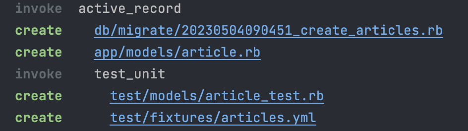
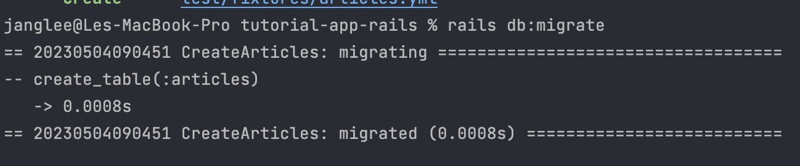
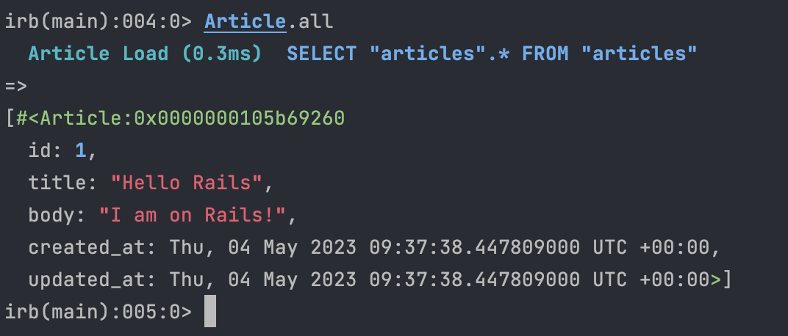
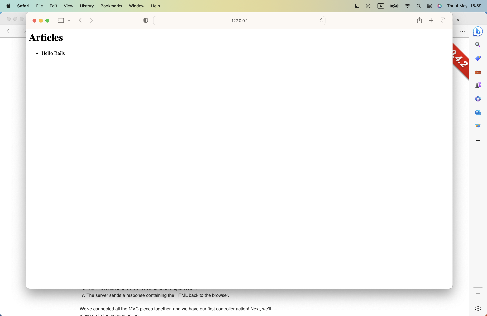

# Basic app using rails

---
- [Basic app using rails](#basic-app-using-rails)
  - [Command](#command)
  - [Basic view](#basic-view)
  - [Basic model](#basic-model)
  - [Display result in view and basic controller](#display-result-in-view-and-basic-controller)

---

## Command

Trong rails, các command được quản lý bởi folder **bin**

- Để xem các lệnh rails cung cấp, sử dụng

```bash
rails --help
```

- Một số lệnh thường dùng cần phải nhớ (nhớ cả short cut nữa nhé):

```bash
rails generate     Generate new code (short-cut alias: "g")
rails console      Start the Rails console (short-cut alias: "c")
rails server       Start the Rails server (short-cut alias: "s")
rails test         Run tests except system tests (short-cut alias: "t")
rails test:system  Run system tests
rails dbconsole    Start a console for the database specified in config/database.yml (short-cut alias: "db")
rails new          Create a new Rails application. "rails new my_app" creates a new application called MyApp in "./my_app"
rails plugin new   Create a new Rails railtie or engine
```

*Hiện tại chưa cần nhớ đâu, vừa làm vừa tra là khác nhớ í mà*

- Khi bắt đầu project, chạy:

```bash
rails s
```

*hoặc*

```bash
rails start
```

## Basic view

Cách đơn giản nhất để tạo 1 trang mới

- Khai báo router:
  1. Tại file **config\routes.rb**, điền dòng lệnh này `get "/articles", to: "articles#index"` ở trong block **Rails.application.routes.draw**

  ```ruby
    Rails.application.routes.draw do
        get "/articles", to: "articles#index"
    end
  ```

  2. Giải thích:
  - `get` Phương thức của http/https
  - Parameter thứ 2 ngay sau get: đường link của router - tức user sẽ có thể truy cập vào route `/articles`
  - `to:` Là một tham số truyền vào có dạng như trên. `articles#index` có nghĩa là cái phương thức get này sẽ truy cập đến **articles_controller.rb**, và gọi function tên là **index** :)) ảo ma quá
  - Vậy khi router này được gọi, thì cái hàm index trên được chạy. Tuy nhiên, bạn nhận thấy thiếu gì không? Đúng rồi, đó là **View**, vậy khi router này được chạy thì view sẽ hiển thị thế nào? Trong rails, khi bạn muốn hiển thị view tương ứng thì bạn hãy nhìn parameter **to:**. Đối với view, nó mang nghĩa là sẽ gọi file **index.html.erb** trong thư mục **articles** và thư mục đó lại nằm trong **app\view**. Dễ hiểu nhỉ? Thực hành thôi :))
  3. Thực hành:
  - Vì bạn đã viết đoạn code trên trong **config\routes.rb** nên để chạy thì bạn cần khai báo hàm index ở trong articles_controller.rb như dưới đây:

  ```ruby
  class ArticlesController < ActionController::Base
    def index

    end
  end
  ```

  - Để tạo view, bạn cần tạo file **index.html.erb** như dưới đây:
    - Cấu trúc thư mục:
      
    - Trong fle **index.html.erb**, các bạn điều một đoạn code html bất kỳ:

    ```html
    <h1>This page is run</h1>
    ```

      *file erb sẽ được giải thích cụ thể trong một topic khác nhé ạ*
  - Start server:

  ```bash
  rails s
  ```

  - Ngắm nhìn kết quả thôi :))

  4. Set up homepage app
  - Một app không có homepage thì ko phải app rồi đúng không. Vậy, để set up homepage, chúng ta cần phải làm gì? Rất đơn giản, thêm đoạn code dưới đây:

  ```ruby
  root "articles#index"
  ```

  - Docs rails cũng giải thích khá dõ cách dùng interface này:
    
  - Nếu bạn quen thuộc với việc gọi hàm get như trên với param **to:**, bạn có thể viết:

  ```ruby
  root to: "articles#index"
  ```

  - **Chú ý**: Root sẽ gọi đến file erb nên khi khai báo bắt buộc phải có file erb rồi mới dùng root nhé!!

## Basic model

Vậy bạn đã thành công tạo view rồi, tuy nhiên nếu chưa có model thì vẫn chưa phải MVC pattern đúng không? :)), vậy chúng ta cùng tạo model nhé

1. Tạo model

- 1 Article sẽ cần title và body đúng không, vậy chúng ta tạo model dựa vào 2 thông tin đó nhé. Tại terminal, gõ:

  ```bash
  rails generate model Article title:string body:text
  ```

  hoặc

  ```bash
  rails g model Article title:string body:text
  ```

  kết quả sẽ là:
  

- Chỉ cần chú ý 2 file **db/migrate/<timestamp>_create_articles.rb** và **app/models/article.rb** nhé

2. Database Migrations
   - Migrations dùng để thay đổi cấu trúc cơ sở dữ liệu
   - Trong rails, migration được viết bằng rb
   - Xét ví dụ trên:

  ```ruby
  class CreateArticles < ActiveRecord::Migration[7.0]
    def change
      create_table :articles do |t|
        t.string :title
        t.text :body

        t.timestamps
      end
    end
  end
  ```

- Giải thích code:
  - `class CreateArticles` được kế thừa bởi module `Migration` nằm trong modle `ActiveRecord`

      *oop chắc không cần phải nói nhỉ :))*

      *module và Active Record Pattern sẽ được trình bày ở topic nâng cao Rails*

  - `create_table` là operation nằm trong module `ActiveRecord::SchemaStatements` và module này include `ActiveRecord::Migration`

      *Cách phát triển bản thân với rails docs mình sẽ trình bày ở topic khác*

  - `create_table` sẽ tự động tạo table với tên table là parameter thứ nhất
  - `create_table` sẽ tự thêm côt `id` là auto-incrementing primary key
  - Các trường còn lại, như định nghĩa trên, tạo cột `title`, type `string` và tương tự
  - `timestamps` sẽ tự động tạo `created_at` và `updated_at`

- Chạy migrate:

  ```bash
  rails db:migarate
  ```

- Kết quả:
  

3. Play with Modal

    Tại terminal, bạn gõ:

    ```bash
    rails console
    ```

    Rails sẽ cung cấp cho bạn một môi trường tương tác từ terminal đến hệ thống của bạn.

    Tiếp theo, bạn gõ:

    ```ruby
    article = Article.new(title: "Hello Rails", body: "I am on Rails!")
    article.save
    ```

    đoạn code trên sẽ save object `article` vào trong database tương ứng

    Giò muốn kiểm tra xem đã thêm được chưa, bạn chỉ cần gõ:

    ```ruby
    article
    ```

    hoặc

    ```ruby
    Article.all()
    ```

    kết quả sẽ là:
    

    *Về sau mình sẽ có chủ đề riêng nói về console trong rails*


## Display result in view and basic controller

  Vậy trong database bạn đã có data rồi, giờ bạn cần display data, chúng ta cần làm gì nhỉ?

  Quay trở lại code router

  ```ruby
  get "/articles", to: "articles#index"
  ```

  Như mình đã giải thích ở trên, nhờ param `to:` thì cả controller và view đều được gọi, đúng chứ. Vậy, để lấy data từ model, chúng ta chỉ cần lấy từ controller và display bằng view thôi, đơn giản đúng không :))

  Thực hành:
    - Tại controller `articles_controller.rb`, các bạn lấy data từ model bằng cách dùng interface `all` được cung cấp bởi class `ApplicationRecord`, kế thừa trong class `model\Article`:

  ```ruby
    @articles = Artivle.all()
  ```

  và đoạn code trên tất nhiên điền vào trong operation index trong `ArticlesController`:

  ```ruby
    def index
      @articles = Article.all
    end
  ```

  tổng quan, class sẽ như thế này:

  ```ruby
  class ArticlesController < ActionController::Base
    def index
      @articles = Article.all
    end
  end
  ```

  Tiếp theo, display data đến view, trong rails, bạn không cần phải return cái gì cả, chỉ cần dùng trực tiếp biến instant đó trong thời điểm render là được rồi.

  Tại `index.htmnl.erb`, bạn gõ:

  ```erb
  <h1>Articles</h1>
  <ul>
    <% @articles.each do |article| %>
      <li>
        <%= article.title %>
      </li>
    <% end %>
  </ul>
  ```

  Chỗ này hơi đau đầu nhỉ, tại sao lại `<% %>` rồi lại `<%= %>` nhỉ :))

  Trong rails định nghĩa:
  > `<% %>`: evaluate the enclosed Ruby code.

  > `<%= %>`: evaluate the enclosed Ruby code, and output the value it returns.

  Hiểu đơn giản là, nếu bạn muốn return value thì dùng `<%= %>`, còn muốn thực thi code thì dùng `<% %>` :)) eassy

  Kết quả sẽ là:
  

>      **ĐẶT VẤN ĐỀ: TẠI SAO LẠI SỬ DỤNG `@article` THAY VÌ CÁC LOẠI BIẾN KHÁC?**
>      Học OOP rồi thì mn có câu trả lời rồi đó

Vậy mình đã hoàn thành việc xây dựng basic router bằng rails ròi đó, mọi ngừoi tự thưởng chàng pháo thay nhé ạ :))
