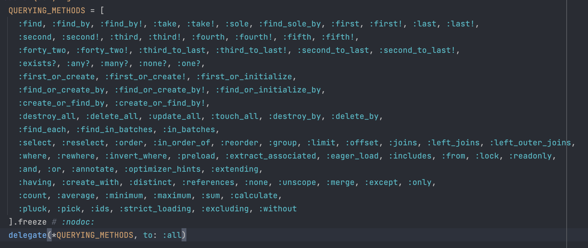
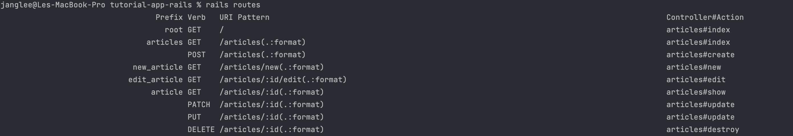

# Basic CRUD Part 1

---
- [Basic CRUD Part 1](#basic-crud-part-1)
  - [Read:](#read)
  - [Create](#create)
  - [Update and destroy](#update-and-destroy)
---

CRUD là các operation cơ bản nhất của các web hiện hành, vì vậy, Rails cung cấp rất nhiều feature quay quanh CRUD.

## Read:

1. Show Articles

    Tại topic trước, các bạn đã được thực hành việc lấy hết tất cả các `articles` bằng interface `all`. Trong topic lần này, chúng ta sẽ đi sâu vào việc lấy từng `articles` dựa vào param nhé!!

   - Các bước thực hiện:
     - Tại `config/routes.rb`, thêm `get "/articles/:id", to: "articles#show"` vào block:

        ```ruby
        Rails.application.routes.draw do
            root 'articles#index'
            get '/articles', to: 'articles#index'
            get '/articles/:id', to: 'articles#show'
        end
        ```

     - Tại `articles_controller.rb`, thêm block dưới đây:

        ```ruby
        def show
            @article = Article.find(params[:id])
        end
        ```
     - Như giải thích tại topic trước, param `to:` sẽ call function, đồng thời render file `erb` tương ứng, thế nên các bạn cần tạo file `show.html.erb` trong thư mục `articles` của `view` và thêm doạn code dưới đây:

        ```erb
            <h1>
                <%= @article.title %>
            </h1>

            <p>
                <%= @article.body %>
            </p>
        ```

    - Giải thích:
      - Phân tích yêu cầu:
        - Bạn được yêu cầu tạo một router, truyền tham số `id`, lấy giá trị `Articles` tương ứng.
        - Muốn lấy dữ liệu từ database, bạn cần tạo 1 operation trong controller tương ứng.
        - Khai báo Router và cuối cùng in kết quả ra View
      - Giải thích code:
        - Đầu tiên bạn cần xác định rằng, phương thức http/https bạn mong muốn là gì? *get/post/put/patch*
        - Bạn cần khai báo router ở đâu? *config/routes.rb*
        - Vì là phương thức `get` có tham số truyền vào, thế nên biến dùng để lưu trữ giá trị đó định nghĩa ra sao trong router? `get 'articles/:id'`
        - Từ router, bạn gọi hàm trong controller và render ra file `erb` tương ứng, bạn cần làm gì? *Sử dụng* `to:`
        - Cách dùng `to:` là gì? `to: 'articles#show` ý nghĩa sao
        - Tạo 1 operation trong `controller` tương ứng
        - Muốn lấy `param` thì làm sao? *Sử dụng `param` có trong module ` ActionController::Parameters`*
        - Tại sao lại sử dụng `:id`, sự khác nhau giữa `:id` và `id:` là gì? *Cú pháp `:id` dùng để định nghĩa 1 symbol, còn `id:` là viết tắt của `:id => ` nhằm định nghĩa hash trong 1 key. **Bạn có thể đọc thêm sự khác nhau giữa symbol và string để có cái nhìn tổng quan khác nhé***
        - `find` là gì? *Là interface có sẵn trong `ActiveRecord` module, bạn đọc có thể tham khảo trong docs api Rails nhé*

            
            *List các query module cung cấp, các bạn cứ tìm hiểu dần nhé*

        - Views chắc mình không cần nói vì sao mình lại làm như v nhỉ :))

        Vậy các bạn đã hoàn thành một router get rồi đó, dễ đúng không :)) Tiếp tục nhé

2. Resourceful Routing

   Chỉ với 2 topic, mình tin các bạn có thể tự tin làm 70% với các router liên quan đến C R D. Tuy nhiên, chúng ta sẽ không thêm các router như các bạn đang nghĩ :)) (Thêm các get, post :)) ), mà chúng ta sẽ sử dụng chức năng `resources` để gộp các router liên quan đến CRUD. Hay ho nhỉ, chúng ta bắt đầu nhé ~~

   - Các bước thực hiện:
     - Tại file `routes.rb`, các bạn xoá 2 dòng code `get` đi, thay vào đó bạn dùng `resources` như sau:

        ```ruby
        Rails.application.routes.draw do
            root "articles#index"

            resources :articles
        end
        ```

     - Tại terminal, bạn gõ:

        ```bash
        rails routes
        ```

     - Và kết quả:

        

    Có thế giải thích thêm (.:format) trong hình nữa
    - Giải thích:
      - `resources` cung cấp cho bạn 1 giải pháp viết routes nhanh hơn rất nhiều
      - Các bạn nhìn hình ảnh trên, các bạn sẽ thắc mắc `Prefix`, `Verb`, ... là gì đúng không?
      - Để nói `Verb`, `Url` và `Controller#Action` mình sẽ không nói nhiều vì giải thích quá nhiều rồi.
      - Còn `Prefix` là gì nhỉ? Cái giá trị này sẽ liên quan đến các operation `Router Helper` có sẵn của Rails. Mình sẽ lấy ví dụ `_url` hoặc `_path`. Giá trị `Prefix` sẽ được cộng với các `router helper` như trên nhằm đưa ra một các viết gọn hơn rất nhiều... Khó hiểu nhỉ?

        - Ví dụ: mình lấy `Prefix` có giá trị là `article`, khi thêm với router helper `_path`, bạn sẽ được 1 helper tương ứng là `article_path`, và cái này có nghĩa là `"/article/#{article.id}"`, và trong file `app/views/articles/index.html.erb`, bạn có thể dùng như sau:

            ```erb
                <h1>Articles</h1>

                <ul>
                <% @articles.each do |article| %>
                    <li>
                    <a href="<%= article_path(article) %>">
                        <%= article.title %>
                    </a>
                    </li>
                <% end %>
                </ul>
            ```

            và `herf` có giá trị `/articles/1` với `id = article.id`

        - Chú ý: Mỗi router sẽ chỉ có 1 giá trị `Prefix` duy nhất, tương ứng 1 action duy nhất, và một `router helper` duy nhất. Thế nên `articles_path` có thể được sử dụng trong `articles/index.html.erb`, tuy nhiên các trang khác là **KHÔNG THỂ**

    - Giới thiệu một xíu về module `Helper`: `link_to`, là một Helper khá ảo ma Canada khi cung cấp cho ngừoi dùng một cách viết thẻ `<a></a>` một cách nhanh nhất:

        ```ruby
            link_to(name = nil, options = nil, html_options = nil, &block)
        ```

    - Các tham số truyền vào bạn có thể nhìn ở trên, tuy nhiên, mình yêu cầu các bạn quan tâm `name` và `options`, `name` chính là giá trị nội dung thẻ và `options` sẽ tạo url dựa vào các tham số bạn truyền vào. Bạn có thể hiểu rõ hơn khi đọc ở [tại đây](https://api.rubyonrails.org/v7.0.4.2/classes/ActionView/Helpers/UrlHelper.html#method-i-link_to)
    - Xét ví dụ trên, ta có thể viết rõ ràng hơn nữa bằng cách:

        ```erb
            <h1>Articles</h1>

            <ul>
            <% @articles.each do |article| %>
                <li>
                    <%= link_to article.title, article_path(article) %>
                </li>
            <% end %>
            </ul>
        ```
        hoặc
         ```erb
            <h1>Articles</h1>

            <ul>
            <% @articles.each do |article| %>
                <li>
                    <%= link_to article.title, article %>
                </li>
            <% end %>
            </ul>
        ```
    - Các helper khác mình sẽ giới thiệu dần ạ

        **Router helper khác helper nhé mọi người**

## Create

Khi bạn muốn tạo 1 instant, bình thường bạn sẽ phải làm rất nhiều công việc, từ phía fe đến be. Tuy nhiên, đối với Rails, nó lại rất dễ dàng. Thông thường, công việc này sẽ do 2 action `new` và `create` thực hiện. Cùng thực hành thôi:

1. Thực hiện:
    - Tại `articles_controller.rb`, bạn thêm 2 operations tương ứng như dưới đây:

        ```ruby
        def new
            @article = Article.new
        end

        def create
            @article = Article.new(title: params[:article][:title], body: params[:article][:body])

            if @article.save
                redirect_to @article
            else
            render :new, status: :unprocessable_entity
        end
        ```
   - Tại folder `view\articles`, tạo một file `new.html.erb` có syntax như dưới đây:

        ```erb
            <h1>New Article</h1>

            <%= form_with model: @article do |form| %>
            <div>
                <%= form.label :title %><br>
                <%= form.text_field :title %>
            </div>

            <div>
                <%= form.label :body %><br>
                <%= form.text_area :body %>
            </div>

            <div>
                <%= form.submit %>
            </div>
            <% end %>
        ```

   - Tại folder `models\articles.rb`, bạn thêm dòng code như sau:

        ```ruby
            class Article < ApplicationRecord
                validates :title, presence: true
                validates :body, presence: true, length: { minimum: 10 }
            end

        ```

2. Giải thích:
- Tại controller:
  - Tại new operation, ta chỉ thực hiện việc tạo instant `@article`. Lý do là khi người dùng gọi operation này, phía view tương ứng là `articles\new.html.erb` sẽ có thể sử dụng instant này để lưu giá trị ngừoi dùng nhập, tuy nhiên không save vào trong database.
  - Khi ngừoi dùng submit form, operation create sẽ có tác dụng lưu giá trị người dùng vừa nhập vào trong database:
    - Đầu tiên, hệ thống tạo một instant, lấy data từ `params`,
    - Hệ thống thực hiện việc lưu instant vào database.
    - Nếu lưu thành công, hệ thống `redirect_to`: chuyển đến màn `action_controller` tương ứng, đối với trường hợp này `index_controller`. Rails api cũng giải thích khá rõ ràng các trường hợp có thể dùng được với api này [tại đây](https://api.rubyonrails.org/classes/ActionController/Redirecting.html#method-i-redirect_to)
    - Nếu không lưu thành công, hệ thống sẽ `render` ra màn tương ứng với các option mình truyền vào. Với trường hợp này sẽ render ra màn `articles\new.html.erb` và với status như trên.

        >
        > Câu hỏi: tại sao lại dùng **status: :unprocessable_entity**, mà không phải **:status :unprocessable_entity**
        >

- Tại view:
  - Phía rails cung cấp helper `form_with` khá thuận tiện cho việc tạo form, bạn đọc có thể dọc api [tại đây](https://api.rubyonrails.org/v7.0.4.2/classes/ActionView/Helpers/FormHelper.html#method-i-form_with) để hiểu cơ chế tạo form của `form_with`
  - Với trường hợp trên, hệ thống sẽ render ra code html như sau:

    ```html
        <form action="/articles" accept-charset="UTF-8" method="post">
            <input type="hidden" name="authenticity_token" value="...">

            <div>
                <label for="article_title">Title</label><br>
                <input type="text" name="article[title]" id="article_title">
            </div>

            <div>
                <label for="article_body">Body</label><br>
                <textarea name="article[body]" id="article_body"></textarea>
            </div>

            <div>
                <input type="submit" name="commit" value="Create Article" data-disable-with="Create Article">
            </div>
        </form>
    ```
    - Khi người dùng ấn submit button, hệ thống sẽ gọi đến action `/articles` với phương thức `Post`, đối chiếu với router, đó chính là gọi đến action `create` trong `articles_controller`:

        

- Tại model
  - Việc create, lưu trong db là một quá trình nhiều bước, thế nên để đảm bảo việc tạo thành công thì cần phải handle các invalid values. Trong rails, các bạn có thể làm điều đó bằng việc sử dụng module `Validations`.
  - Đối với đoạn code trên, sử dụng `validates` method để định nghĩa các điều kiện. Validate thứ nhất có nghĩa là `title` value bắt buộc phải presence(require). Tương tự validate thứ 2, tuy nhiên thêm điều kiện length phải có độ dài tối thiểu = 10. Cụ thể của validate mình sẽ nói ở topic sau.
  - Tuy nhiên, khi validate, chúng ta cần phải handle error, thế nên, tại `new.html.erb`, bạn update code như sau:

    ```erb
        <h1>New Article</h1>

        <%= form_with model: @article do |form| %>
        <div>
            <%= form.label :title %><br>
            <%= form.text_field :title %>
            <% @article.errors.full_messages_for(:title).each do |message| %>
            <div><%= message %></div>
            <% end %>
        </div>

        <div>
            <%= form.label :body %><br>
            <%= form.text_area :body %><br>
            <% @article.errors.full_messages_for(:body).each do |message| %>
            <div><%= message %></div>
            <% end %>
        </div>

        <div>
            <%= form.submit %>
        </div>
        <% end %>
    ```
  - Bạn đọc có thể đọc api của `full_message_for` [tại đây](https://api.rubyonrails.org/v7.0.4.2/classes/ActiveModel/Errors.html#method-i-full_messages_for) để hiểu cách sử dụng

3. Update code
  - Sử dụng strong parameters:
    - Trong hàm `create` tại controller trên, mình tạo instant của `Articles` bằng cách sử dụng trực tiếp `params`. Tuy nhiên, cách này chưa tối ưu. Vì nếu mà người dùng truyền sai định dạng, sẽ có thể gây khó khăn trong việc handle error. khi mở rộng hệ thống, nếu cứ sử dụng cách viết này => gây rất nhiều khó khăn.
    - Thế nên, khi handle các parameters được truyền vào, chúng ta nên sử dụng 1 tính năng của Rails cung cấp, là **Strong Parameters**. Để thực hiện, các bạn update controller bằng cách thêm đoạn code dưới đây:

        ```ruby
            private

            def article_params
                params.require(:article).permit(:title, :body)
            end
        ```
    - Và tại operation create, chúng ta update code như dưới đây:

        ```ruby
            def create
                @article = Article.new(article_params)

                if @article.save
                    redirect_to @article
                else
                    render :new, status: :unprocessable_entity
                end
            end
        ```
    - Để hiểu rõ hơn `permit`, bạn đọc có thể đọc [tại đây](https://api.rubyonrails.org/v7.0.4.2/classes/ActionController/Parameters.html#method-i-permit)
    - Để hoàn thiện code, bạn cần cung cấp url tại trang chủ để người dùng có thể vào màn tạo mới, các bạn có thể viết như sau:

        ```erb
            <%= link_to "New Article", new_article_path %>
        ```

## Update and destroy

 Chúc mừng các bạn, khi bạn đọc đến đây thì bạn đã có trong mình lượng kiến thức Rails đủ dùng rồi :))) Mình tự tin các bạn có thể làm được 2 phần này không cần mình giúp đỡ nữa rồi. Tuy nhiên, mình vẫn sẽ giới thiệu với các bạn một số kiến thức bạn có thể dùng và hướng giải quyết 2 vấn đề trên:

1. Partial
   - Để nói đơn giản, partial chính là component, nếu bạn có đoạn code nào muốn tái sử dụng trong view folder, bạn có thể sử dụng Partial
   - Cách dùng:
     - Tạo file `_form.html.erb` trong folder `articles` và viết code như sau:

        ```erb
            <%= form_with model: article do |form| %>
            <div>
                <%= form.label :title %><br>
                <%= form.text_field :title %>
                <% article.errors.full_messages_for(:title).each do |message| %>
                <div><%= message %></div>
                <% end %>
            </div>

            <div>
                <%= form.label :body %><br>
                <%= form.text_area :body %><br>
                <% article.errors.full_messages_for(:body).each do |message| %>
                <div><%= message %></div>
                <% end %>
            </div>

            <div>
                <%= form.submit %>
            </div>
            <% end %>
        ```
     - Muốn sử dụng Partial, bạn có thể dùng `render`:

        ```erb
            <%= render "form", article: @article %>
        ```
        >
        > Tại sao trong **_form.html.erb** lại dùng **model: article** mà không phải **@article**
        >

2. Cách giải quyết 2 vấn đề trên:

   Mình sẽ đưa ra hint để các bạn có thể tự tay viết hàm update và destroy nhé :))). Đáp án mình sẽ không đưa đâu, nên các bạn cố gắng dọc kỹ phía trên nhé:

    - Edit
      - Cần tạo một view edit có form, syntax đặt tên file bạn có thể gõ trên terminal `rails routes`
      - Trước khi render page, cần lấy giá trị id của instant bạn muốn edit thì bạn cần làm gì? *Truyền vào param giá trị id mình cần edit*
      - Bạn cần tạo một operation trong controller để lấy giá trị instant tại db. *Sử dụng find*
      - Bạn có thể dùng hàm `update` để update giá trị.
      - Bạn cần dùng **Strong Parameters** để handle các giá trị nhập vào từ params
      - Bạn cần tạo một link để ngừoi dùng ấn vào đó, redict đến màn edit.
    - Destroy:
      - Bạn cần tạo một link để ngừoi dùng ấn vào để xoá
      - Bạn cần tìm kiến instant, rồi sau đó mới xoá
      - Khi xoá thành công, bạn có thể redict đến màn index. *Sử dụng root_path* với status là *:see_other*
      - Bạn có thể tham khảo code dưới đây:

        ```erb
            <li>
                <%= link_to "Edit", edit_article_path(@article) %></li>
            <li>
                <%=
                    link_to "Destroy",
                    article_path(@article),
                    data:
                    {
                        turbo_method: :delete,
                        turbo_confirm: "Are you sure?"
                    }
                %>
            </li>
        ```
        Chúc các bạn thành công!!!
        
Vậy là các bạn đã hoàn thành CRUD đơn giản trong rails rồi đó, các bạn hãy tự thưởng mình một tràng pháo tay đi nào!! Các ban đã vất vả rồi
