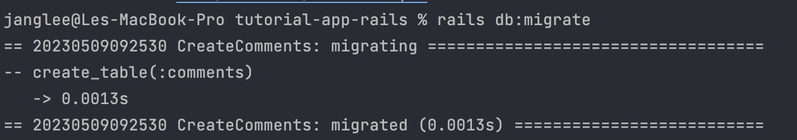
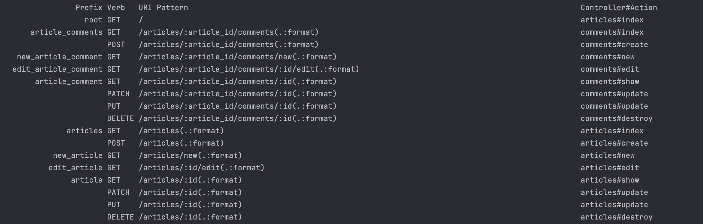

# Basic CRUD part 2

---
- [Basic CRUD part 2](#basic-crud-part-2)
  - [Create new model](#create-new-model)
  - [Associating Models](#associating-models)
  - [Adding a Route for Comments](#adding-a-route-for-comments)
  - [Tạo controller và view](#tạo-controller-và-view)
---

Trong chủ đề lần này, mình sẽ hướng dẫn các bạn cách phát triển Project lần trước bằng việc tạo thêm Model. Bạn được yêu cầu tạo thêm một bảng Comment với các trường dưới đây:

| # Cột     |  Type  |
| --------- | :----: |
| commenter | string |
| body      |  text  |


## Create new model

1. Thực hiện:

    - Các bạn chạy cmd:

      ```bash
        rails generate model Comment commenter:string body:text article:references
      ```

    - Tại file `model\Comment.rb` các bạn điền code dưới đây:

      ```ruby
        belong_to :article
      ```

    - Các bạn chạy cmd:

      ```bash
        rails db:migrate
      ```
    - Kết quả sẽ như hình dưới đây:

      

2. Giải thích code:

   - Tại file `migrate\_create_comments.rb`:

      ```ruby
        class CreateComments < ActiveRecord::Migration[7.0]
          def change
            create_table :comments do |t|
              t.string :commenter
              t.text :body
              t.references :article, null: false, foreign_key: true

              t.timestamps
            end
          end
        end
      ```

     - Với những code tạo bảng và các trường, mình sẽ không nói nhiều.
     - Các bạn chú ý cho mình `references`, `references` có tác dụng khởi tạo tham chiếu tới bảng khác trong db, cụ thể là khởi tạo FK, bạn có thể đọc thêm [tại đây](https://api.rubyonrails.org/classes/ActiveRecord/ConnectionAdapters/Table.html#method-i-references). Trong trường hợp này, `references` sẽ khởi tạo FK `article_id` tại bảng `create` và không null

   - Tại file `model\Comment.rb`:

      ```ruby
        class Comment < ApplicationRecord
          belongs_to :article
        end
      ```
      - `belong_to :article` là cách thiết lập Active Record association. Mình sẽ nói ở vế sau. Bạn có thể hiểu đơn giản là mqh 1-n.

## Associating Models

- Phân tích yêu cầu: 1 `article` sẽ gồm có nhiều `comment` và ngược lại, 1 `comment` chỉ có 1 `article`. Và đây là mối quan hệ 1-n.

- Cách thực thi:
  - Tại `model\Articles.rb`, các bạn thêm dòng code dưới đây vào class `Article`:

    ```ruby
      has_many :comments
    ```
  - Tại `model\Comments.rb`, các bạn định nghĩa quan hệ với model `Articles` bằng interface `belongs_to`
- Giải thích:
  - Vì 1 `article` sẽ gồm có nhiều `comment`, thế nên bạn dùng `has_many` và bạn truyền parameter là gồm *name* của model bạn muốn thiết lập mối quan hệ. Đối với `has_many`, bạn nên viết symbol là số nhiều và ngược lại, `belongs_to` truyền symbol là số ít.

## Adding a Route for Comments

- Tại file `routes.rb`, bạn thêm code dưới đây:

  ```ruby
    Rails.application.routes.draw do
      root 'articles#index'

      resources :articles do
        resources :comments
      end
    end
  ```

- Giải thích:
  - Tại temrinal, bạn chạy:

    ```bash
      rails routes
    ```

  - Kết quả sẽ như hình dưới đây:
  

  - Bạn hoàn toàn có thể để 2 resource bên ngoài như dưới đây:

    ```ruby
      resources :articles
      resources :comments
    ```

  - Tuy nhiên, mình để 2 resource lồng nhau để thể hiện tính linh hoạt trong routes

## Tạo controller và view

- Thực hiện:
  - Tại terminal, bạn gõ:

    ```bash
      rails generate controller Comments
    ```
  - Tại file `articles\show.html.erb`, các bạn chèn nội dung dưới đây:

    ```erb
      <h1><%= @article.title %></h1>

      <p><%= @article.body %></p>

      <ul>
        <li><%= link_to "Edit", edit_article_path(@article) %></li>
        <li><%= link_to "Destroy", article_path(@article), data: {
          turbo_method: :delete,
          turbo_confirm: "Are you sure?"
        } %></li>
      </ul>

      <h2>Add a comment:</h2>
      <%= form_with model: [ @article, @article.comments.build ] do |form| %>
        <p>
          <%= form.label :commenter %><br>
          <%= form.text_field :commenter %>
        </p>
        <p>
          <%= form.label :body %><br>
          <%= form.text_area :body %>
        </p>
        <p>
          <%= form.submit %>
        </p>
      <% end %>
    ```

  - Trong `comments_controller.rb`, bạn viết hàm `create` như sau:

    ```ruby
      class CommentsController < ApplicationController
        def create
          @article = Article.find(params[:article_id])
          @comment = @article.comments.create(comment_params)
          redirect_to @article
        end

        private
        def comment_params
          params.require(:comment).permit(:commenter, :body)
        end
      end
    ```

- Giải thích code
  - View:
    - Bạn cần đọc kỹ lại interface `form_with` để hiểu cách tạo route khi submit form [tại đây](https://api.rubyonrails.org/v7.0.4.2/classes/ActionView/Helpers/FormHelper.html#method-i-form_with)
    - Vì bạn đã tạo mối quan hệ giữa các model `Article` và `Comment`, thế nên bạn hoàn toàn có thể tương tác với model `Comment` thông qua `Article`, ví dụ như `@article.comments.build` sẽ có nhiệm vụ tạo `@comment`
    - Strong parameters được sử dụng trong `CommentsController`
    - Mối quan hệ giữa 2 model được sử dụng trong controller. Bạn hoàn toàn có thể truy vấn đến model `comments` thông qua `article`

