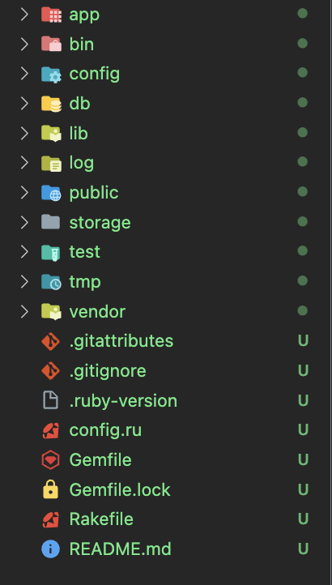

#Rails structure

---
- [Giới thiệu về cấu trúc dự án trong Rails](#giới-thiệu-về-cấu-trúc-dự-án-trong-rails)
---
## Giới thiệu về cấu trúc dự án trong Rails

| # File/Folder         |                                                                                                                                                Mục đích                                                                                                                                                 |
| --------------------- | :-----------------------------------------------------------------------------------------------------------------------------------------------------------------------------------------------------------------------------------------------------------------------------------------------------: |
| app/                  |                                                                                  Chứa các controllers, models, views, helpers,... của ứng dụng. Trong docs này sẽ tập trung sử dụng các file/folder ở trong app folder                                                                                  |
| bin/                  |                                                                                            Chứa các script để chạy ứng dụng và có thể chứa các script khác bạn config vào để set up cũng như deploy ứng dụng                                                                                            |
| config/               |                                                                                                                Contains configuration for your application's routes, database, and more                                                                                                                 |
| config.ru             |                                                                                                                 Rack configuration for Rack-based servers used to start the application                                                                                                                 |
| db/                   |                                                                                                               Contains your current database schema, as well as the database migrations.                                                                                                                |
| Gemfile, Gemfile.lock |                                                                                 These files allow you to specify what gem dependencies are needed for your Rails application. These files are used by the Bundler gem.                                                                                  |
| lib/                  |                                                                                                                                 Extended modules for your application.                                                                                                                                  |
| log/                  |                                                                                                                                         Application log files.                                                                                                                                          |
| public/               |                                                                                               Contains static files and compiled assets. When your app is running, this directory will be exposed as-is.                                                                                                |
| Rakefile              | This file locates and loads tasks that can be run from the command line. The task definitions are defined throughout the components of Rails. Rather than changing Rakefile, you should add your own tasks by adding files to the lib/tasks directory of your application. Tóm lại **ĐỪNG CÓ ĐỤNG VÀO** |
| storage/              |                                                                                                                                 Active Storage files for Disk Service.                                                                                                                                  |
| test/                 |                                                                                                                             Unit tests, fixtures, and other test apparatus.                                                                                                                             |

Tổng quan thì hệ thống sẽ có các file/folder dưới đây

*Nhìn sợ thật nhưng mà chúng ta sẽ đi qua mọi thứ nhé :))*

